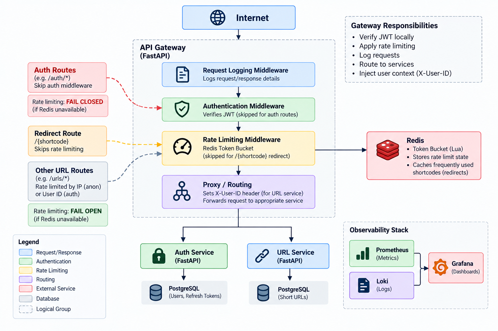

# API Gateway & URL Shortener Microservice Platform

A FastAPI-based microservices platform featuring an API Gateway, Authentication Service, and URL Service. The gateway provides request routing, JWT authentication, rate limiting, and structured logging, while Prometheus and Grafana provide observability across all services.

Built as a backend infrastructure and distributed systems learning project.

## Architecture


### Request Flow

1. Client sends request to API Gateway
2. Logging middleware captures request metadata
3. JWT is verified locally in gateway using the public key
4. Redis-backed token bucket rate limiting is applied
5. Gateway injects `X-User-ID` for authenticated URL-service requests
6. Request is proxied to the appropriate backend service
7. Metrics are scraped by Prometheus and visualized in Grafana

## Services
| Service   | Responsibility                        | Stack                        |
|-----------|----------------------------------------|-------------------------------|
| Gateway   | Routing, JWT verification, rate limiting| FastAPI, httpx, Redis |
| Authentication Service | Signup, login, JWT issuance, refresh token rotation  | FastAPI, Postgres |
| URL Service | URL shortening, ShortCode management, redirects              | FastAPI, Postgres, Redis |
| Observability| Metrics collection and structured logging for each service | Prometheus, Grafana, Loki, structlog|

## Key Design Decisions

- **Authentication:** JWTs are verified locally in the API Gateway using the public key, eliminating an auth-service round trip on every request.
- **Rate Limiting:** Redis-backed Lua token bucket algorithm, keyed by user ID for authenticated requests and client IP for anonymous requests.
- **Redirect Path:** `/url/{shortcode}` is exempt from rate limiting because redirects are expected to be read-heavy. In a production deployment, this traffic would typically be offloaded to a CDN or edge cache.
- **Observability:** Request logging middleware runs outermost so that rejected, and errored requests are still captured in logs.
- **Caching:** Redirect lookups are cached in Redis to reduce database load on frequently accessed short URLs.
- **Refresh Token Rotation:** Refresh tokens are rotated on use to reduce replay risk.

## Tech Stack
### Backend
- FastAPI
- SQLAlchemy
- Alembic
- Pydantic

### Databases & Caching
- PostgreSQL
- Redis

### Authentication
- PyJWT (RS256)

### Observability
- Prometheus
- Grafana
- Loki

### Testing
- Pytest, Pytest-asyncio
- RESPX
- Continuous Integration (Github Actions)

### Infrastructure
- Docker
- Docker Compose


## Setup

### Prerequisites

- Python 3.13+
- Docker
- Git

### Installation

```bash
git clone https://github.com/Ohm-MyCode/API-Gateway.git

cd API-Gateway

python -m venv .venv

source .venv/bin/activate

pip install uv

uv sync --frozen
```

### Configuration

Create a `.env` file using `.env.example`:

```bash
cp .env.example .env
```
Generate a token hash key:

```bash
python -c "import secrets; print(secrets.token_hex(32))"
```

Copy the generated value into:

```env
TOKEN_HASH_KEY=<generated_value>
```

Make sure to setup Postgres User and password and update URL_DB and AUTH_DB accordingly.

Edit the remaining values in .env as required.

## Running Locally

```bash
mkdir -p app/secrets

openssl genrsa -out app/secrets/private.pem 4096

openssl rsa \
  -in app/secrets/private.pem \
  -pubout \
  -out app/secrets/public.pem

docker compose up --build

```

## Testing
Coverage includes authentication flows, middleware behavior, rate limiting, proxy routing, URL operations, and error handling.

For running tests locally:
- setup .env according to '.env.example'. 
- Ensure Docker is installed and Docker daemon is running
- Ensure you are at root directory of project

```bash
chmod +x run_tests.sh
./run_tests.sh
```

The script will:
- Generate RSA keys for testing if not already present
- Start PostgreSQL test containers
- Start a Redis test container
- Apply Alembic migrations
- Execute all test suites

_Note_: Pytest runs 3 times because of shared Prometheus registry across services in a single process, not an issue in production since each service runs independently

## Continuous Integration

GitHub Actions automatically executes:

- Dependency installation
- Database migrations
- Authentication Service tests
- Gateway tests
- URL Service tests

on every push to the main branch.

## Future Improvements

- Add tracing using OpenTelemetry.
- Introduce service discovery instead of static service mappings.
- Containerize test execution with Docker Compose for a fully isolated test environment.
- Improve rate limiting logic for Auth Service endpoints like /login, /signup etc by introduction of multi-keyed rate limiting.
- Add API documentation aggregation through the gateway.
- Circuit Breakers for configured timeout and limited retries.
- Do Load testing as I haven't load tested this project yet and I would like to before calling it production-ready.
- Add a basic frontend for interacting with the platform.

## Challenges Faced

- **JWT Refresh Token Rotation** – Implementing secure refresh token rotation proved more complex than initially expected. This included invalidating old refresh tokens after issuing new ones, detecting token reuse as a potential token-theft signal, and revoking all active refresh tokens for a compromised user.

- **Building a Custom API Gateway Proxy** – Designing the request forwarding logic required careful decisions about which URL segments should be consumed by the gateway and which should be forwarded to downstream services. Correctly propagating headers and preserving request context across services was another challenge.

- **Integration Testing** – Writing and debugging integration tests with pytest was challenging due to fixtures not properly handling database cleanup between test runs, Redis-related timing issues, and ensuring application lifespan events executed correctly within the test environment.

- **Python Imports in Docker** – Ensuring consistent import resolution across local development, testing, and Docker containers required restructuring imports and carefully managing container working directories.


## AI Usage

AI tools were used as a development aid during this project, primarily for:

- Grafana dashboard creation and alloy configuration setup
- Documentation assistance and polishing
- Debugging discussions and implementation review

All architecture, service design, API design, authentication flows, database schema design, rate-limiting logic, testing strategy, and final code integration were implemented, reviewed and validated by me.